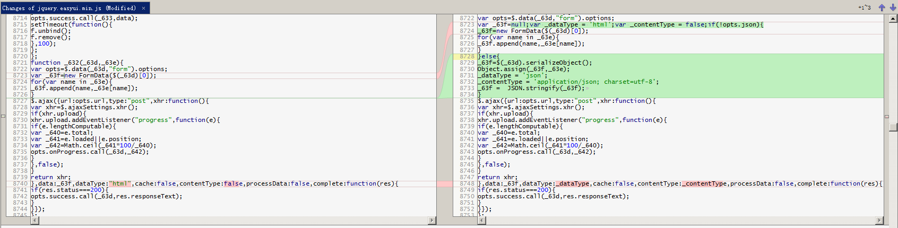

# EasyUI的From

## 提交和回调
第一级控制参数是ajax,如果form的options的ajax为false，那么就把当前表单直接submit了（当前页面会提交）。
否则，根据第二级控制参数iframe来决定提交行为。

如果设置了form的options的iframe为true，那么提交时，会动态创建一个iframe，在iframe中又动态创建了form，然后把当前form的数据复制到新建的form中，在iframe中提交新的Form,并在Iframe的onload时机上，调用form的回调函数。此时回调函数的参数，其实是iframe提交后返回的整个html的body(字符串形式)。

否则，会使用$.ajax的方式来提交表单。这种方式，EasyUI给了一些特殊的参数设置，让提交行为更加像一个普通的表单Submit（但不刷新整个页面）：提交到后台的数据，是FormData类型,contentType没有设置，即默认的application/x-www-form-urlencoded形式，和普通的html的form的submit的方式是一致的。希望后台返回的数据类型dataType，是html的，也是和普通的表单提交是一致的。这样回调函数拿回来的，依旧是一个Html形式的字符串，和使用iframe方式提交差不多。

这种方式还有一个特点，回调的调用时机，不是ajax的success,而是complete，而且回调参数是`res.responseText`。在回调函数内，只能通过参数的内容的关键字来判断这次提交是否成功了。

## 改造

### 只有表单提交返回成功时，才调用回调函数

jquery.easyui.min.js(v-1.7.2,l-8741),增加判断`if(res.status===200)`时才调用`opts.success.call(_63d,res.responseText);`。这样一来，表单提交失败时，回调函数将不再有机会处理错误。有两种解决办法，一种是在定义表单的时候，增加一个opts.error函数用于回调，还有一种方式，是在整个应用层面，通过`$(document).ajaxError`来统一处理服务器端返回的错误。

### 提交时将数据以Json方式提交

jquery.easyui.min.js(v-1.7.2,l-8723),判断form表单是否有`json`这样的属性，如果有，将Ajax的dataType参数设置为json,将contentType参数设置为'application/json; charset=utf-8'，将要提交的数据FormData，转换为json：`_63f =  JSON.stringify(_63f);`

